# Image captioning with attention mechanism

### Updates
- **1/5/2021**: Added overview of paper in README 
- **3/5/2021**: Added Resnet as pre-trained CNN for feature extraction
- **5/5/2021**: Added config.ini to set pre-processing, training, evaluation and model parameters.
- **6/5/2021**: *Model in more detail* section which explains the Hard attention model. Added appendix explanation of LSTM architecture.
- **7/5/2021**: Added early stopping and Inceptionv3 functionality for feature extraction

## Implementation & Experiments

Implementation of Soft Attention for image captioning described in [Show, Attend and Tell](https://arxiv.org/abs/1502.03044). 

For our implementation we chose to make use of ResNet instead of the proposed VGG-16 model in the encoder stage. Other pre-trained CNN's are to be implemented for performance comparison. 

## Environment setup
Setup conda environment and install required packages.
```
conda create --name env
conda activate env
conda install pytorch pydot keras Pillow nltk
```

## Running instructions

#### Build vocabulary
Build vocabulary by tokenizing the words within the Flickr8k training set. 
```
python build_vocab.py 
```

#### Training model
Train the model with the following command:
```
python train.py 
```
#### Evaluate model
Evaluate the model on the Flickr8k testing set
```
python eval.py 
```
## Overview of Show attend and tell approach
For the task of image captioning, a model is required that can predict the words of the caption in a correct sequence given the image. This can be modeled as finding the caption that maximizes the following log probability:    


<p align="center">
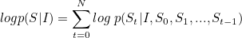 
</p>


where S is the caption, I the image and S<sub>t</sub>, the word at time *t*.

The probability of a word depends on the previously generated words and the image, hence the conditioning on these variables in the equation. The training data consists of various images with multiple descriptions/interpretations manually produced by humans. The training phase involves finding the parameters in the model that maximizes the probability of captions given the image in the training set.

RNN's provide a method of conditioning on the previous variables using a fixed sized hidden vector. This hidden vector is then used to predict the next word just like a feed forward neural network.


<p align="center">
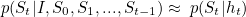 
</p>


In this equation you can see that the hidden state (h<sub>t</sub>) represents the previously generated words S<sub>0</sub>, ..., S<sub>t-1</sub>.

Equation 2 is used to model the probability distribution over all words in the vocabulary using a fully connected layer followed by a softmax:

<p align="center">
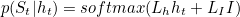 
</p>


where L<sub>h</sub> and L<sub>I</sub> are weight matrices of the fully connected layer with inputs taken as one concatenated vector from h<sub>t</sub> and I. From this distribution, we select the word with the maximum probability as the next word in the caption. Now at the step t+1, the conditioning on the previously generated words should also involve this newly generated word(St). But the RNN hidden state (h<sub>t</sub>) is conditioned on S<sub>0</sub>, ..., S<sub>t-1</sub>. So S<sub>t</sub> is then combined with h<sub>t</sub> through a linear layer followed by a non-linearity to produce h<sub>t+1</sub> which is conditioned on S<sub>0</sub>, ..., S<sub>t</sub>.

<p align="center">
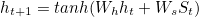 
</p>

The overall RNN architecture is given below.
<p align="center">
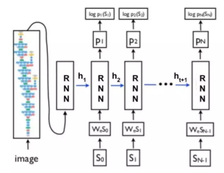
</p>

Since RNN is basically like the conventional feed forward neural comprising of linear and non-linear layers, the back-propagation of loss during training is straight-forward without performing heavy inference computations. The only difference with a normal neural network is that the clubbing of the previous hidden vector and newly generated word is done through the same set of parameters at each step. This is equivalent to feeding the output to the same network as input and hence the name recurrent neural network. This avoids blowing up the size of the network which otherwise would require a new set of parameters at each step. The RNN unit can be represented as shown in the below figure.

<p align="center">
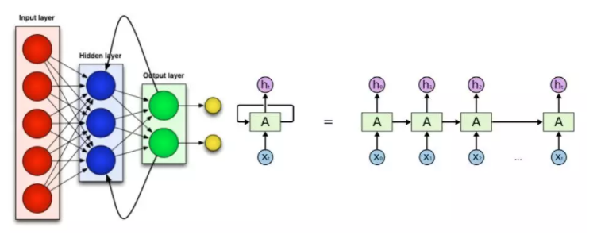
</p>

The image is represented as a vector by taking the penultimate layer (before the classification layer) output from any of the standard convolutional networks viz. VGGnet, GoogleNet etc. This produces a feature vector which represents the image in a vector.

For words, we want the representation should be such that the vectors for the words similar in meaning or context should lie close to each other in the vector space. An algorithm that converts a word to a vector is called word2vec and it is arguably the most popular one. word2vec draws inspiration from the famous quote “You shall know the word from the company it keeps” to learn the representation for words. GLoVE is another learning algorithm for obtaining vector representations for words that performs better than word2vec but is more complex.

Given a word “computer”, the task is to predict the context words “learning”, “and” and  “vision” from first sentence and “we”, “love” and “vision” from last sentence. Therefore the training objective becomes maximising the log probability of these context words given the word “computer”. The formulation is:

<p align="center">
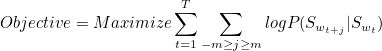 
</p>

where m is the context window size ((max length of caption - t (here 2)) and t runs over the length of the corpus (i.e. every word in the collection of sentences). S<sub>w<sub>n</sub></sub> is the corresponding word vector to S<sub>n</sub>. P(S<sub>w<sub>t+j</sub></sub>|S<sub>w<sub>t</sub></sub>) is modelled by the similarity or inner product between the context word vector and center word vector. For each word there are two vectors associated with it viz. when it appears as context and when it is the center word represented by R and S respectively.

Therefore, 

<p align="center">
 
</p>

Here denominator is the normalization term that takes the similarity of center word vector with the context vectors of every other word in vocabulary so that probability sums to one.

### Concept of a Attention Mechanism

When there is clutter in the scene it becomes very difficult for simpler systems to generate a complex description of the image. We, humans, do it by getting a holistic picture of the image at first glance. Our focus then shifts to different regions in the image as we go on describing the image. For machines, a similar attention mechanism has been proposed to mimic human behavior. This attention mechanism allows only important features from an image to come to the forefront when needed. At each step, the salient region of the image is determined and is fed into the RNN instead of using features from the whole image. The system gets a focused view from the image and predicts the word relevant to that region. The region where attention is focused needs to be determined on the basis of previously generated words. Otherwise, newly generated words may be coherent within the region but not in the description being generated.

Until now the output of the **fully connected layer** was used as input to the RNN. This output corresponds to the entire image. For attention we need to get a feature corresponding only to a small subsection of the image. The output of a **convolutional layer** encodes local information and not the information pertaining to the whole cluttered image.

The outputs of the convolutional layer are 2D feature maps where each location was influenced by a small region in the image corresponding to the size (receptive field) of the convolutional kernel.

<p align="center">
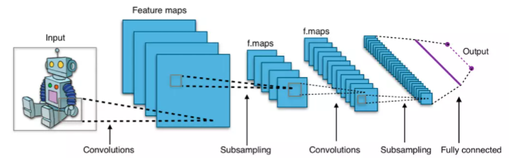
</p>

Just before the output layer, there is a fully connected layer which is like one stretched vector and represents the whole input image whereas the convolutional layer outputs (all the layers before the fully connected one) are like a 2D image with many dimensions. The vector extracted from a single feature map at a particular location and across all the dimensions signify the feature for a local region of the image.  

At each time step, we want to determine the location on the feature map that is relevant to the current step. The feature vector from this location will be fed into the RNN. So we model the probability distribution over locations based on previously generated words. Let L<sub>t</sub> be a random variable with *n* dimensions with each value corresponding to a spatial location on feature map. L<sub>t,i</sub>=1 means the i<sup>th</sup> location is selected for generating the word at the *t* step. Let a<sub>i</sub> be the feature vector at the i<sup>th</sup> location taken from convolutional maps.

The value we need is

<p align="center">
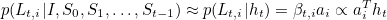 
</p>

Here probability of choosing a location (β<sub>t,i</sub>) has been taken as directly proportional to the dot product i.e. similarity between vector at that location and the RNN hidden vector.

Now on the basis of probability distribution, the feature vector corresponding to the location with the maximum probability can be used for making the prediction, but using an aggregated vector from all the location vectors weighted according to the probabilities makes the training converge simply and fast. Therefore we choose to focus/attend to several locations, with the probability p(L<sub>t,i</sub>|h<sub>t</sub>) indicating the importance. This is known as soft attention. In the stochastic mechanism (hard attention), a **single** location is sampled on the basis of probability distribution and only that location is used in the RNN unit.

So let the z<sub>t</sub> be the context or aggregated vector which is to be fed into the RNN.

<p align="center">
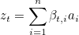 
</p>

So that Equation 2 becomes

<p align="center">
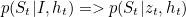 
</p>

So this mechanism simulate human behavior by focusing their attention to various parts of the image while describing it and naturally with the focused view, a more sophisticated description can be generated for the image which caters to even the finer level details in the image. Below is an example of the RNN generating words along the corresponding attention.
<br>
<br>
<p align="center">
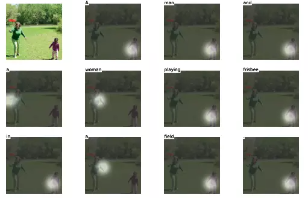
</p>

### Model in more detail


Below is the visual representation of a LSTM cell. 
<p align="center">
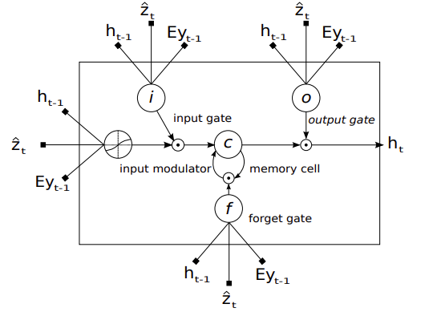
</p>

A LSTM cell, lines with bolded squares imply projections with a learnt weight vector. Each cell learns how to weigh its input components (input gate), while learning how to modulate that contribution to the memory (input modulator). It also learns weights which erase the memory cell (forget gate), and weights which control how this memory should be emitted (output gate).

Ẑ<sub>t</sub> represents the context vector produced by the attention layer, h<sub>t-1</sub> the previous hidden state of the LSTM achieved at the previous time step, *E* the embedding layer, and y<sub>t-1</sub> the generated word at the previous time step.


#### Encoder
The model takes a single raw image as input, and generates a caption ***y*** encoded as a sequence of 1-of-*K* encoded words. 

<p align="center">
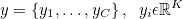 
</p>

where K is the vocabulary size and C is the length of the generated caption. 

The use of a pre-trained CNN is used to extract a set of feature vectors known as **annotation vectors**. There are *L* annotation vectors produced by the CNN, each of which have *D* dimensions and represent a corresponding part of the image. 

<p align="center">
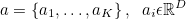 
</p>

In order to obtain a correspondence between the feature vectors and portions of the 2-D image, we extract features from a lower convolutional layer unlike previous work which instead used a fully connected layer. Therefore, instead of using a single feature vector to represent the the entire image, we use feature maps produced by convolutional layers to represent parts of the image in a grid-type manner. 

In this paper makes use of the pre-trained VGG-16 CNN, which was state of the art  in 2016, in order to extract a 512 dimensional 14x14 feature map. The 14x14 feature map is then flattened out to form a 196x512 matrix. 

#### Decoder

The decoder makes use of the LSTM network that predicts a word at each time step conditioned on the context vector (produced by the attention layer), the previous hidden state and the previously generated words. 

Using T<sub>s,t</sub> : ℝ<sup>s</sup> → ℝ<sup>t</sup> to denote a simple affine transformation with parameters that are learned, 

<p align="center">
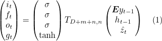 
</p>

<p align="center">
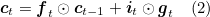 
</p>

<p align="center">
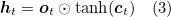 
</p>

Here **i**<sub>t</sub> represents the input, **f**<sub>t</sub>  the forget, **c**<sub>t</sub>  the memory, **o**<sub>t</sub>  the output and **h**<sub>t</sub>  the hidden state of the LSTM. ẑ ∈ ℝ<sup>D</sup> is the context vector, capturing the visual information associated with a particular input location, as explained below. **E** ∈ ℝ<sup>m x K</sup> is the embedding matrix, where *m* and *n* denote the embedding and LSTM dimensionality respectively. σ and ⵙ is the logistic sigmoid activation and the element-wise multiplication respectively.

The context vector ẑ is a dynamic representation of the relevant part of the image input at time *t*. We define a mechanism C that computes ẑ from the annotations vectors a<sub>i</sub>,  *i = 1, .... , L* corresponding
to the features extracted at different image locations. For each location *i*, ∅ computes a positive weight α<sub>i</sub> which denotes the probability that locatiuon *i* is the right place to focus for producing the next word. 

The weight α<sub>i</sub> of each annotation vector a<sub>i</sub> is generated by an *attention model* f<sub>*att*</sub> for which they use a multilayer perceptron conditioned on the previous hidden state h<sub>t-1</sub> The hidden state changes as the RNN advances in the caption generation steps. "Where" the network looks depends on the sequence of words that have already been generated.

<p align="center">
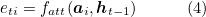 
</p>

<p align="center">
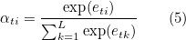 
</p>
Once the weights are computed, the context vector ẑ is computed by

<p align="center">
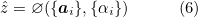 
</p>
where ∅ returns a single vector given the set of annotation vectors and their corresponding weights. 

The initial memory state and hidden state of the LSTM are the average of the annotation vectors fed through two separate MLPs.

<p align="center">
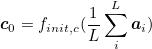 
</p>

<p align="center">
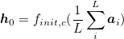 
</p>

In this work, they use a deep output layer [[Pascanu et al.,2014](https://arxiv.org/abs/1312.6026)] to compute the output word probability given the LSTM state, the context vector and the previous word:

<p align="center">
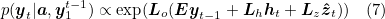 
</p>

where **L**<sub>o</sub> ∈ ℝ<sup>K x m</sup>, **L**<sub>h</sub> ∈ ℝ<sup>m x m</sup>,**L**<sub>z</sub> ∈ ℝ<sup>m x D</sup>, and **E** are learned papameters initialized randomly.


##### Stochastic “Hard” Attention
The location variable s<sub>t</sub> is used to indicate the location where to focus when generating the t<sup>th</sup> word. s<sub>t,i</sub> is an indicator one-hot variable where 1 in the i<sup>th</sup> index (out of *L*) indicates the extracted feature to be used at time *t*. 

By treating the the attention locations as intermediate latent variables, they assign a multinoulli distributution parameterized by {α<sub>i</sub>}, and view ẑ as a random variable:

<p align="center">
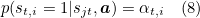 
</p>

<p align="center">
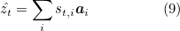 
</p>

From this we can see that context vector ẑ is the attention vector from where s<sub>t,i</sub>=1. 

From here they define a objective function L<sub>s</sub> that is a variational lower bound on the marginal log-likelihood log(**y**|**a**) of observing the sequence of words **y** given image features **a**. The learning algorithm for parameters *W* of the models can be derived by directly optimizing L<sub>s</sub>.

<p align="center">
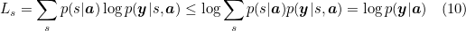 
</p>

We therefor want to maximize log(**y**|**a**)  (which is the log probability of the caption given the annotation vectors). log(**y**|**a**) is then expanded to log Σ<sub>s</sub> p(s|**a**) p(**y**|s, **a**) where s<sub>t,i</sub> is the location variable at time *t* and *i* the grid-location corresponding to an annotation variable a<sub>i</sub>. If s<sub>t,i</sub>=1 then p(s<sub>t,i</sub>=1| s<sub>j < t</sub>, **a**) = α<sub>t,i</sub>. This process is stochastic (we either pick the annotation vector or not) and so the expected value of picking a value of a specific grid position **i** at a specific time **t** is equal to it's expected value. From here we get an inequality that says that the log of the expectation is greater or equal to the expectation of the log. This gives us a lower bound that we would like to maximize.

They make use of the product rule to achieve the following:
<p align="center">
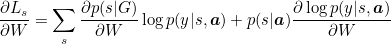 
</p>
where ∂L<sub>s</sub>/∂W is the gradient of L<sub>s</sub>.

We do the following simplifcation
<p align="center">
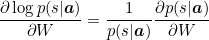 
</p>
<p align="center">
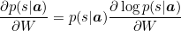 
</p>

If we substitute this in, we get

<p align="center">
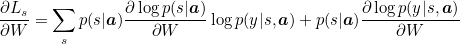 
</p>

and finally, we rewrite this to get

<p align="center">
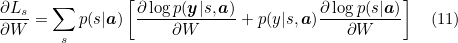 
</p>

This expression can be converted to an expectation and therefore can be approximated via sampling. 

Equation 11 suggests a Monte Carlo based sampling approximation of gradient with respect to the model parameters. This can be done by sampling the location s<sub>t</sub> from a multinouilli distribution defined by Equation 8.

<p align="center">
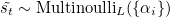 
</p>

<p align="center">
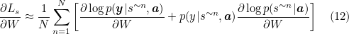 
</p>

Since p(s|**a**) is unknown, we assume a uniform distribution 1/N. A moving average baseline is used to reduce the variance in the Monte Carlo estimator of the gradient. This avoids a noisy/jumpy gradient at each batch. Upon seeing the k<sup>th</sup> mini-batch, the moving average baseline is estimated as an accumulated sum of the previous log likelihoods with exponential decay:

<p align="center">
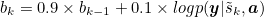 
</p>

To further reduce the estimator variance, an entropy term on the multinouilli distribution H[s] is added. Also, with probability 0.5 for a given image, we set the sampled attention location s˜ to its expected value α. Both techniques improve the robustness of the stochastic attention learning algorithm. The final learning rule for the model is then 

<p align="center">
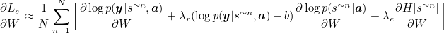 
</p>

where λ<sub>r</sub> and λ<sub>e</sub> are two hyper-parameters set by cross-validation. This is formulation is equivalent to the REINFORCE learning rule, where the reward for the attention choosing a sequence of actions is a real value proportional to the log likelihood of the target sentence under the sampled attention trajectory.

In making a hard choice at every point, ∅({a<sub>i</sub>},{α<sub>i</sub>}) from Equation 6 is a function that returns a sampled a<sub>i</sub> at every point in time based upon a multinouilli distribution parameterized by α.

## Results

The model was validated on the standard Flickr8k dataset. State of the art accuracy is achieved. We've included the best performing model (Merge-EfficientNetB7-Glove-RV) from our previous repo. Results are as follows:


| Model                                                         | BLEU-1 | BLEU-2 | BLEU-3 | BLEU-4 |
|---------------------------------------------------------------|--------|--------|--------|--------|
| [ Hard attention (Xu et al.,2016)](https://arxiv.org/pdf/1502.03044.pdf)           |   **67**   |  45.7  |  31.4  |  21.3  |
| [Google NIC (Vinyals et al., 2014)](https://arxiv.org/pdf/1411.4555.pdf)           |   63   |   41   |   27   |    -   |
| [Log Bilinear (Kiros et al., 2014)](http://proceedings.mlr.press/v32/kiros14.pdf)  |  65.6  |  42.4  |  27.7  |  17.7  |
| [Merge (Tanti et al., 2017)](https://arxiv.org/pdf/1708.02043.pdf)                 | 60.1   | 41.1   | 27.4   | 17.9   |
| Merge-EfficientNetB7-Glove-RV                                                      | 63.62  | 40.47  | 26.63  | 16.92  |
| Hard attention VGG-16                                                              | 66.54  | **45.8**  | 31.6  | 20.93  |
| Hard attention ResNet                                                              | 66.73  | 45.45  | **31.81**  | **22.14**  |


## Extentions
<!-- - Soft attention implementation (also known as Global attention) -->
- [ ] Add single instance caption along with an attention visualization utility 
- [x] Incorporate pre-trained embedding layer (Glove)
- [x] Add config file to remove command line arguments and improve ease of use. 
- [x] Add support for other pre-trained CNN's for feature extraction.
- [ ] Fine tune hyper-parameters
- [ ] Adjust model architecture (Add dropout, different embedding/hidden/lstm layer sizes)
- [x] Early stopping 


# Appendix 
#### These are explanations for myself
### LSTM explanation
In general, a LSTM model takes 3 inputs, the input from the current time step X<sub>t</sub>, the output from the previous time step h<sub>t-1</sub> and the "memory" of the previous unit C<sub>t-1</sub>. The LSTM cell outputs anew output h<sub>t</sub>. Therefore, this single unit makes decision by considering the current input, previous output and previous memory and generates a output and alters its memory. 

<p align="center">
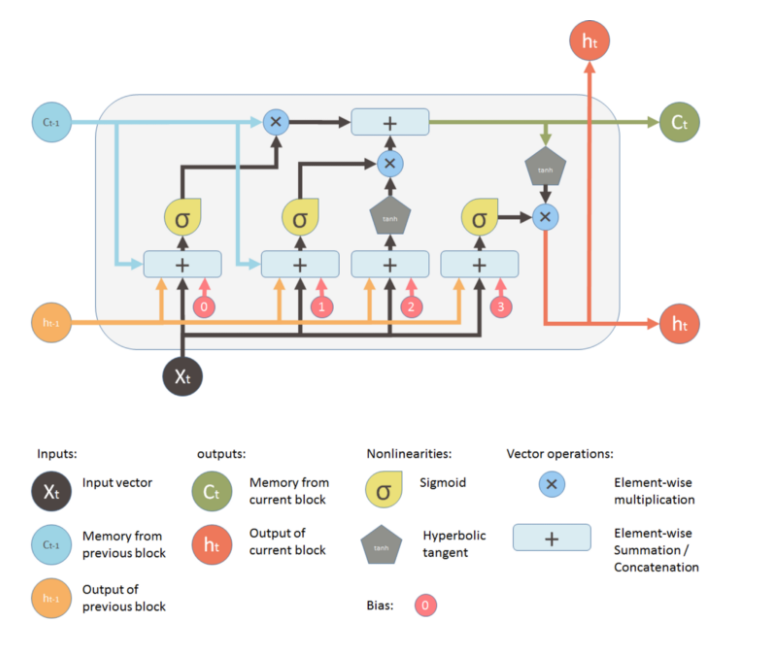
</p>

These cells are stacked (recurrent) to form the LSTM model.

<p align="center">
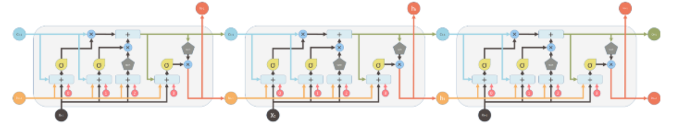
</p>

The way the internal memory C<sub>t</sub> is changed can be compared to water flowing through a pipe. Assuming memory is water flowing through a pipe, you want to control the flow of the water through making use of two valves:
- The first valve is known as the **forget valve**. If shut, all memory is lost and if fully opened, all old memory is passed through. 
- The second valve is the **new memory valve** which can be thought of as a T-shaped valve where old and new memory is merged. Exactly how much of the new memory is allowed through is controlled by this valve. 

<p align="center">
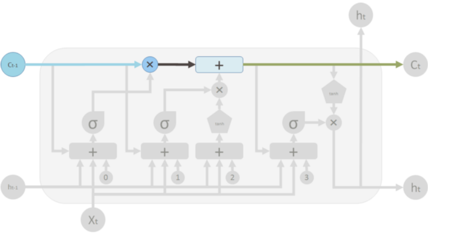
</p>

The top "pipe" is can be seen as the memory pipe. The input (C<sub>t-1</sub>) is the old memory (vector). The ✖ indicated the forget valve which is an element-wise multiplication operation which multiplies the old memory learned with a either a vector that is close to 0 if you want the old memory to be lost or a vector that i close to 1 if you want to retain the old memory.  Each cell learns how to modulate the new input contribution the memory.

The "+" indicates the new memory valve, which is a piece-wise summation . This is where the old and the new memory is merged. How much new memory should be added to the old memory is controlled by another valve, the ✖ below the + sign.

After these two operations, you have the old memory C<sub>t-1</sub> changed to the new memory C<sub>t</sub>.

<p align="center">

</p>


The first valve (+) is the forget valve and is controlled by a one layer neural network, with inputs: 
- h<sub>t-1</sub> output of the previous LSTM unit
- X<sub>t-1</sub> input for the current LSTM unit
- C<sub>t-1</sub> the memory for the previous block
- b<sub>0</sub> bias vector

The single NN makes us of a sigmoid activation function and outputs the forget valve, which is applied to the old memory C<sub>t-1</sub> by element-wise multiplication.

<p align="center">
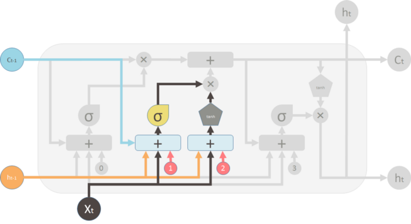
</p>

The 2nd valve is called the new memory valve and is also a single layered NN, that takes in the same input as the forget valve. This valve controls how much of the new memory should influence the old memory. It also makes use of a sigmoid activation function.

The new memory itself is generated by another single layered NN that makes use of a tanh activation function. The output of this NN will element-wise multiple the new memory valve, and add the old memory to form the new memory. 

<p align="center">
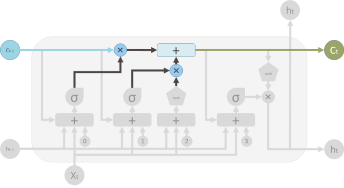
</p>

The two ✖'s indicate the forget valve and the new memory valve. The outputs of the valves are merged to form the new memory C<sub>t</sub>.

<p align="center">
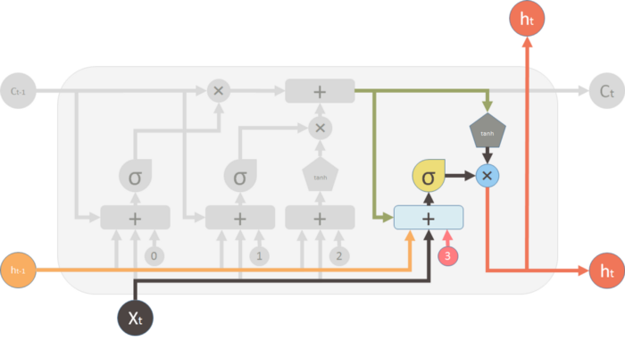
</p>

Finally, we generate the output of the LSTM unit. The output is influenced by the new memory, the previous output h<sub>t-1</sub>, the input X<sub>t-1</sub> and the bias vector. This ✖ valve controls how much new memory should output to the next LSTM cell. 

The most common description of a LSTM cell is given below
<p align="center">
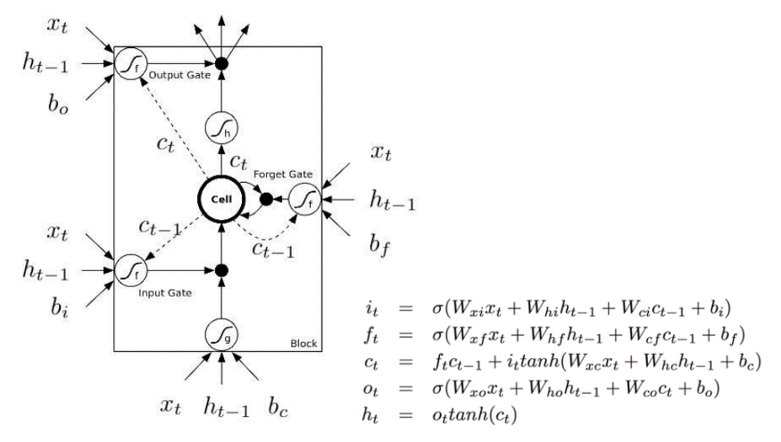
</p>
The major difference between the two variations is that this diagram doesn’t treat the memory unit C as an input to the unit. Instead, it treats it as an internal “Cell”.

The previous diagrams show explicitly how the memory C passes from one cell to the next which makes it easier to understand (in my opinion). Also, the computations performed should be ordered and it is not clear in this representation. For example to calculate the output of the unit, you need C<sub>t</sub> before you can calculate h<sub>t</sub>.

However, the second representation shows delay and ordered operations with dash and solid lines. Dash lines means the old memory, which is available at the beginning. Some solid lines means the new memory. Operations require the new memory have to wait until C<sub>t</sub> is available.

These two representations are however the same. Here is a diagram of the original representation in the form of the second representation. 

<p align="center">

</p>
